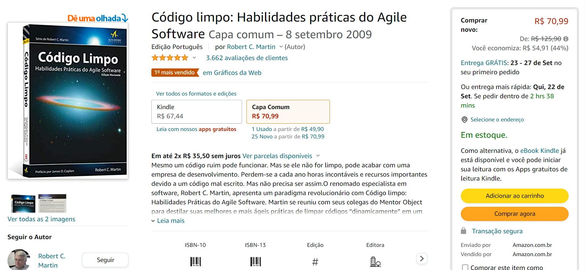

# Automação Web Amazon

<h1 align="center">
    
</h1>

## Projeto

Projeto de automação web com validação de carrinho de compras.

## Funcionalidades

-  Adicionar itens ao carrinho
-  Validar se os itens estão no carrinho
-  Excluir um item
-  Validar se o item foi excluído

## Tecnologias

Este projeto foi desenvolvido utilizando as seguintes tecnologias:

- Selenium Webdriver
- Java
- JUnit
- Page Object
- Page Factory

## Clonar repositório

Clone o repositório

```bash
git clone https://github.com/deniscoelho-js/automacao.git

```
